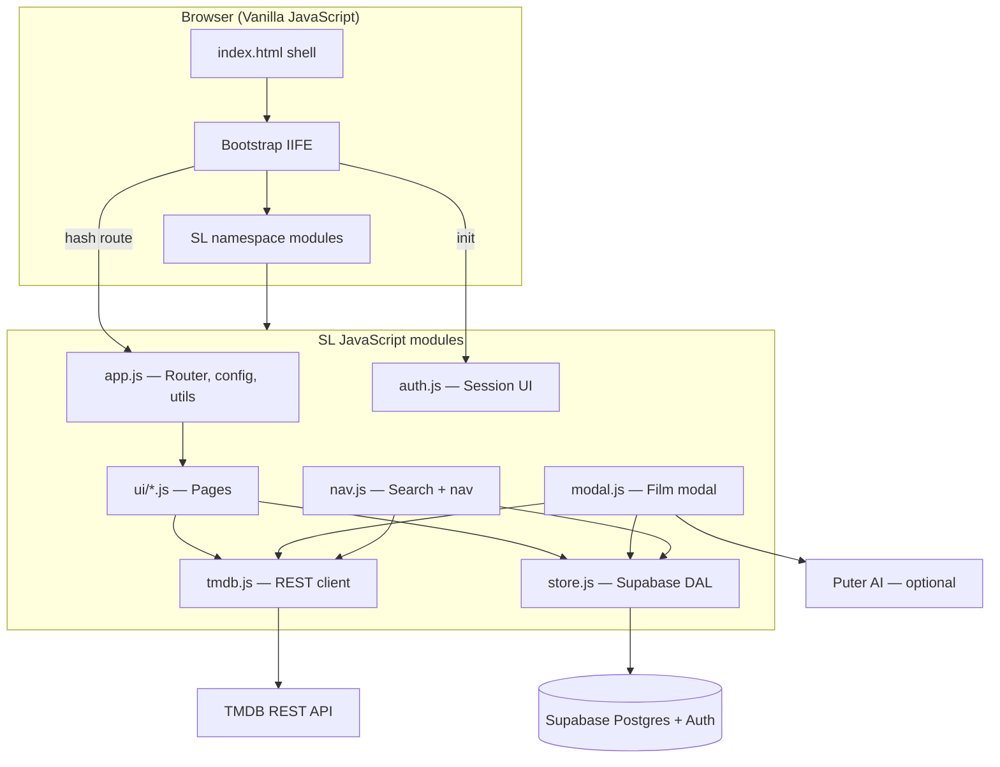
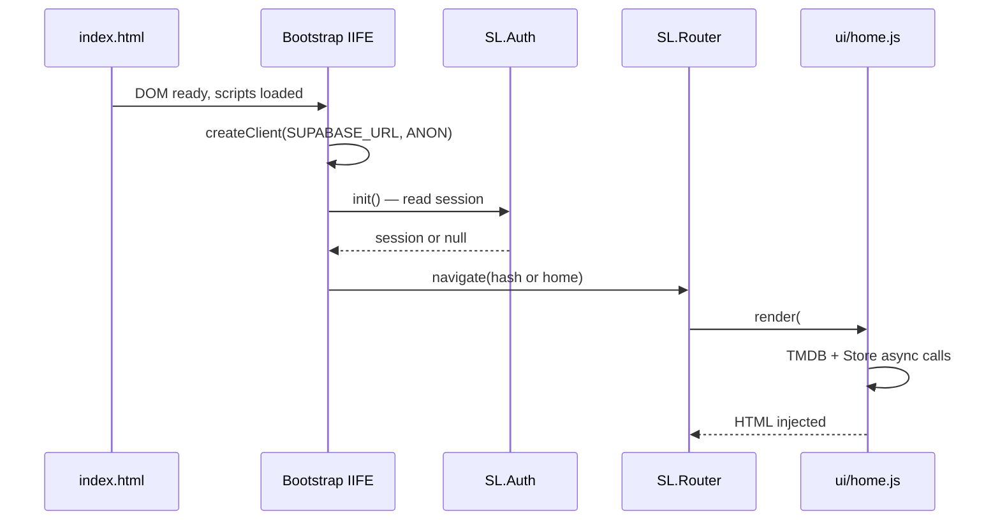
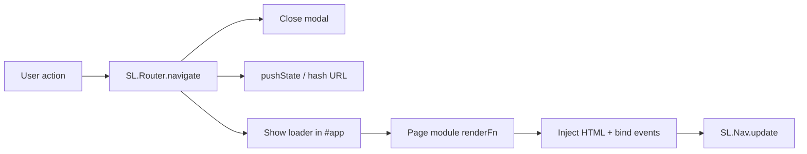
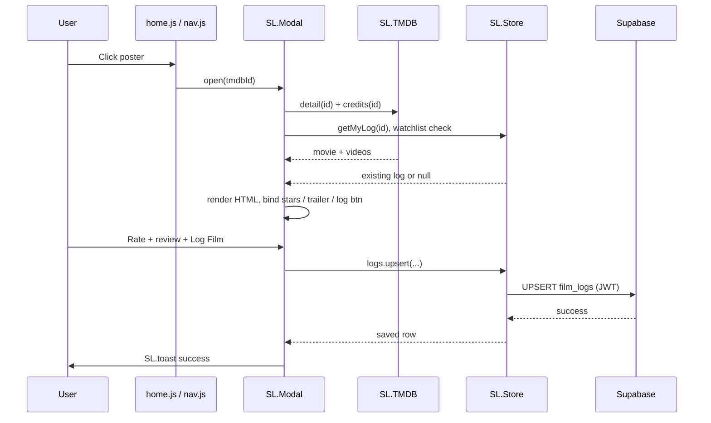
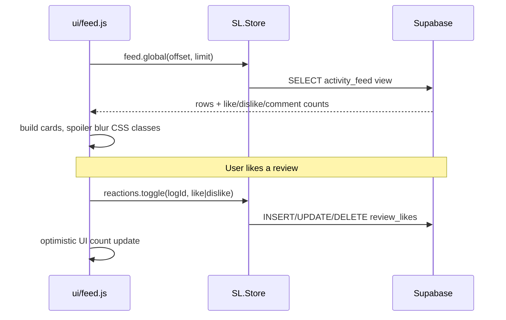
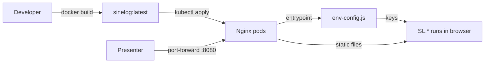

# SineLog — Presentation Guide

Use this document for course demos and technical presentations. It explains **how JavaScript drives the system** (system flow) and **what to show live** (demonstration flow).

Related docs: [README.md](README.md) · [system_design.md](system_design.md) · [javascript_research.md](javascript_research.md) · [DEPLOYMENT.md](DEPLOYMENT.md)

---

## 1. Elevator Pitch (30 seconds)

> **SineLog** is a film diary and social discovery app built as a **vanilla JavaScript SPA**. The browser runs all UI logic in modular `SL.*` namespaces. **TMDB** supplies film metadata; **Supabase** stores logs, profiles, and the activity feed. Optional **Puter AI** compares a film to the user’s watch history. The same static frontend ships in **Docker** and scales on **Kubernetes**.

---

## 2. System Flow — How JavaScript Runs the Application

### 2.1 High-level architecture

### 2.2 Script load order (execution pipeline)

JavaScript modules load **sequentially** in `index.html`. Each file attaches APIs to the shared `window.SL` object.

| Order | File | Role |
|------:|------|------|
| 1 | `/env-config.js` | Injects `window.__SL_ENV__` (K8s/Docker secrets at runtime) |
| 2 | `app.js` | Config, router, formatters, toast, debounce |
| 3 | `tmdb.js` | `SL.TMDB` — fetch wrapper for TMDB |
| 4 | `auth.js` | `SL.Auth` — session state + auth panel |
| 5 | `store.js` | `SL.Store` — Supabase CRUD |
| 6 | `nav.js` | `SL.Nav` — navbar + debounced search |
| 7 | `modal.js` | `SL.Modal` — movie detail / logging |
| 8 | `ui/home.js` … | Page renderers registered with router |
| 9 | Bootstrap `<script>` | Creates Supabase client, `SL.Auth.init()`, first navigation |

### 2.3 SPA routing flow (History API)

`SL.Router` in `app.js` implements client-side navigation without full page reloads.

1. User clicks nav link → `SL.Router.navigate('feed')`.
2. Router closes any open modal (`SL.Modal.close()`).
3. Router pushes `history.pushState` → URL becomes `#feed` (or `#profile?user=…`).
4. `#app` shows a loading state, then runs the registered page function.
5. Browser **Back** triggers `popstate` → router re-renders the previous view.

### 2.4 Flow: Open movie modal and log a film

This is the core **JavaScript + API + database** path to highlight in a presentation.

**Key JavaScript concepts demonstrated:** `async/await`, `Promise.all`, DOM template strings, event listeners after render, guarded auth (`SL.Auth.isAuthed()`).

### 2.5 Flow: Activity feed and social interactions

### 2.6 Flow: AI taste match (optional)

Triggered from `modal.js` when the user clicks **Analyze**.

1. Requires signed-in user and at least one `film_logs` row.
2. JavaScript builds a **prompt string** from TMDB synopsis + last 15 logs.
3. `puter.ai.chat(prompt)` returns text; parser normalizes string vs object shapes.
4. On failure, **local heuristic** `localTasteMatch()` fills the panel (graceful degradation).

### 2.7 Flow: Deployed app (Kubernetes → browser)

JavaScript always executes **in the client**. Kubernetes only serves static assets and injects environment variables.

---

## 3. Demonstration Flow — Live Presentation Script

**Suggested duration:** 12–15 minutes (app only) · 25–30 minutes (app + Kubernetes)

**Before you start:** TMDB + Supabase keys configured, `supabase-schema.sql` applied, migrations run if using spoilers/comments, hard refresh browser, DevTools console open (show no errors).

### Phase A — Application & JavaScript (12–15 min)

| Step | What to do | What to say (JavaScript angle) |
|------|------------|--------------------------------|
| **A1** | Open app (local static server or `kubectl port-forward`) | “Single `index.html` shell; all behavior is loaded via ordered script tags into the `SL` namespace.” |
| **A2** | Home loads — point at trending rows | “`ui/home.js` calls `SL.TMDB.trending()` with `fetch`; results become HTML strings injected into `#app`.” |
| **A3** | Use navbar search, pick a film | “`nav.js` debounces input with `SL.debounce`, then TMDB search runs; selecting a title calls `SL.Modal.open(id)`.” |
| **A4** | In modal: show metadata, cast scroll, **Trailer** | “`modal.js` uses `Promise.all` for TMDB detail, credits, and Supabase log state; trailer opens YouTube via a click handler on a dedicated overlay layer.” |
| **A5** | Sign up / sign in (if not authed) | “`auth.js` wraps Supabase Auth; session is stored client-side and sent as JWT on every `store.js` request.” |
| **A6** | Rate with half-stars, write review, toggle spoilers, **Log Film** | “Star math uses pointer position on each star button; `logs.upsert()` sends one object to Postgres with RLS enforcing `auth.uid()`.” |
| **A7** | Watchlist toggle + toast | “Immediate feedback via `SL.toast`; persistence through `SL.Store.watchlist.toggle`.” |
| **A8** | **Analyze** taste match (signed in, with logs) | “Optional AI path: prompt built in JS, external Puter API, with local fallback function if AI fails.” |
| **A9** | Go to **Feed** — like/dislike, expand comments | “Feed module reads a SQL view; reaction handlers call `store.js` and update counts in the DOM without reload.” |
| **A10** | Open **Profile** — tabs for logs, likes, watchlist | “Same router pattern; tab switches re-query `SL.Store` and re-render sections.” |
| **A11** | Change hash / use browser Back | “Router `pushState` / `popstate` gives SPA navigation without losing state unnecessarily.” |
| **A12** | Resize to mobile width | “CSS + JS modules share one codebase; modal uses `dvh` and responsive rules in `styles.css`.” |

### Phase B — Kubernetes (optional, +12 min)

Follow [DEPLOYMENT.md](DEPLOYMENT.md) demos in order:

1. **Deploy** — `kubectl get pods -n sinelog`
2. **Self-healing** — delete a pod, watch replacement
3. **Scale** — `kubectl scale deployment …`
4. **Rolling update** — `kubectl set image …`
5. **Rollback** — `kubectl rollout undo …`

**Bridge sentence:** “The JavaScript application does not change in the cluster—we only package static files and inject API keys at container start via `env-config.js`.”

### Demo checklist (quick)

- [ ] No red errors in browser console
- [ ] Home hero + rows visible
- [ ] Search → modal opens
- [ ] Trailer opens YouTube tab
- [ ] Log film saves and shows ✓ LOGGED
- [ ] Feed loads; reaction works when signed in
- [ ] Profile tabs show data
- [ ] Back button changes SPA view

---

## 4. JavaScript Rubric Talking Points

| Topic | Where it lives | One-line evidence |
|-------|----------------|-------------------|
| **Modularity** | `SL.*` per file | IIFE modules expose small public APIs |
| **Async I/O** | `tmdb.js`, `store.js`, pages | `async/await` + `Promise.all` |
| **DOM manipulation** | All `ui/*.js`, `modal.js` | Template literals → `innerHTML` → `addEventListener` |
| **State** | `auth.js`, modal stars | Session + UI state in closures |
| **Events** | Feed reactions, cast rail | Delegation and direct binding after render |
| **Security** | `SL.esc`, Supabase RLS | Escape user text; writes require JWT |
| **UX patterns** | `app.js`, `styles.css` | Toast, loaders, debounce, spoiler blur |
| **API integration** | TMDB, Supabase, Puter | Thin wrappers, no heavy framework |

---

## 5. Troubleshooting During a Live Demo

| Symptom | Likely cause | Quick fix |
|---------|--------------|-----------|
| Setup screen on load | Missing TMDB key in `app.js` or `env-config.js` | Set keys, refresh |
| Empty feed / log fails | Supabase schema or RLS | Run `supabase-schema.sql` + migrations |
| Trailer does nothing | Pop-up blocked | Allow pop-ups for localhost |
| AI analyze empty | No logs yet or Puter blocked | Log 2–3 films first; mention local fallback |
| Port-forward dies | Terminal closed | Re-run `kubectl port-forward svc/sinelog 8080:80 -n sinelog` |

---

## 6. Q&A Prep

**Why vanilla JavaScript instead of React?**  
Smaller deploy artifact, direct control over DOM updates, and clear module boundaries for learning routing, fetch, and state without framework magic.

**Where is business logic?**  
Split: validation/UI in JS modules; authorization in Postgres RLS; aggregations in SQL views (`activity_feed`, `profile_stats`).

**How do keys stay secret?**  
Anon key is public by design (RLS protects data). TMDB key is injected at deploy time, not committed—see `k8s/secret.yaml` and `docker-entrypoint.sh`.
