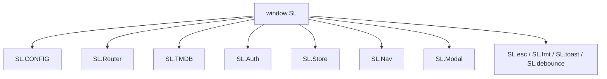

# SineLog — JavaScript Architecture Research

How **vanilla JavaScript** is organized and applied in SineLog: modules, routing, async data, DOM updates, and integration with Supabase and TMDB.

**Live flows for presentations:** [PRESENTATION.md](PRESENTATION.md)

---

## 1. The `SL` Namespace

The global `window.SL` object is the single integration point between scripts. Files must load in the order defined in `index.html` so dependencies exist before use.



### Pattern: Immediately Invoked Function Expression (IIFE)

Every major file wraps code to avoid polluting globals:

```js
SL.TMDB = (() => {
  async function request(endpoint, params) { /* ... */ }
  return { trending, detail, search /* ... */ };
})();
```

**Benefits:** private helpers, explicit public API, no build step required.

---

## 2. `app.js` — Application Backbone

| Export | Purpose |
|--------|---------|
| `SL.CONFIG` | TMDB + Supabase URLs/keys (from `__SL_ENV__` or placeholders) |
| `SL.Router` | SPA navigation, History API, page registry |
| `SL.img` / `SL.fmt` | TMDB image URLs, date/runtime/rating formatters |
| `SL.esc` | HTML entity escape (XSS mitigation in templates) |
| `SL.toast` | Ephemeral status messages |
| `SL.debounce` | Delay rapid input (search fields) |
| `SL.ratingText` / `SL.ratingLabel` | Half-star display helpers |

### Router implementation highlights

```js
// Register once per page module
SL.Router.register('home', SL.Home.render);

// Navigate programmatically
await SL.Router.navigate('feed');

// URL reflects state
// #feed  or  #profile?user=username
window.history.pushState({ name, params }, '', hash);
```

On `popstate`, the router re-renders without pushing another history entry (`push: false`).

---

## 3. `tmdb.js` — TMDB Client

Thin `fetch` wrapper:

- Builds URL with `api_key` query param
- Throws on non-OK HTTP status
- Methods map 1:1 to TMDB endpoints (`/trending/movie/week`, `/movie/{id}`, etc.)

**Important for modal:** `detail(id)` uses `append_to_response: 'release_dates,videos'` so JavaScript can read `movie.videos.results` for the trailer button.

---

## 4. `auth.js` — Session and Auth UI

- `SL.Auth.init()` — reads Supabase session on load, subscribes to auth changes
- `SL.Auth.isAuthed()` / `SL.Auth.uid()` — guards store and modal actions
- `SL.AuthPanel` — login, signup, password reset UI injected into `#auth-box`

Unauthenticated users can browse; logging and social actions open the auth panel.

---

## 5. `store.js` — Data Access Layer

Encapsulates all Supabase `from('table')` calls. The browser never writes raw SQL.

| Namespace | Examples |
|-----------|----------|
| `SL.Store.logs` | `upsert`, `getMyLog`, `getForUser`, `getForMovie`, `remove` |
| `SL.Store.watchlist` | `toggle`, `isInList`, `getAll` |
| `SL.Store.feed` | `global`, `following` (activity_feed view) |
| `SL.Store.follows` | `toggle`, `isFollowing` |
| `SL.Store.reactions` | `toggle(logId, 'like' \| 'dislike')`, `getMine` |
| `SL.Store.comments` | `list`, `add`, `update`, `delete` |
| `SL.Store.profiles` | lookup by username, stats |

Typical call shape:

```js
const { data, error } = await sb()
  .from('film_logs')
  .upsert({ /* row */ })
  .select()
  .single();
```

Errors bubble to UI as `SL.toast(e.message)`.

---

## 6. `nav.js` — Global Chrome

- Renders navbar and mobile menu from current route
- **Debounced search:** after idle typing, queries TMDB movies and Supabase profiles
- Selecting a movie → `SL.Modal.open(id)`; selecting a user → profile route with params

---

## 7. `modal.js` — Richest UI Component

### Lifecycle

1. `open(tmdbId)` — show modal shell, call `render(id)`
2. `render` — parallel fetch, build large template string, assign `sheet.innerHTML`
3. Bind listeners (stars, trailer, log, watchlist, taste match, cast scroll)
4. `close()` — hide modal, restore body scroll

### JavaScript techniques used

| Technique | Example in modal |
|-----------|------------------|
| `async/await` | `render`, log save, taste match |
| `Promise.all` | movie + credits + log + watchlist |
| Half-star rating | `getBoundingClientRect` + pointer X position |
| Conditional DOM | trailer only if YouTube key exists |
| Layered overlay | `.modal-hero-overlay` for clickable trailer above overlapping body |
| Progressive enhancement | AI taste match with local `localTasteMatch()` fallback |
| Dynamic sections | `loadCommunityReviews`, similar films appended after render |

### Trailer button

```js
document.getElementById('modal-trailer-btn')?.addEventListener('click', (e) => {
  e.stopPropagation();
  window.open(`https://www.youtube.com/watch?v=${key}`, '_blank', 'noopener,noreferrer');
});
```

Video key resolution order: Trailer → Teaser → first YouTube entry in TMDB results.

---

## 8. Page Views (`ui/*.js`)

Each page exports a render function registered with the router.

| File | Data sources | Notable JS |
|------|--------------|------------|
| `home.js` | TMDB trending, top rated, hero | Poster grids, `onclick` → modal |
| `feed.js` | `activity_feed`, reactions, comments | Spoiler toggle classes, optimistic counts |
| `profile.js` | logs, stats, follow, taste match | Tabs, follow button, edit profile modal |
| `search-page.js` | TMDB discover, genres | Genre filters, infinite-style rows |

**Rendering pattern:**

```js
async function render(container, params) {
  container.innerHTML = loadingTemplate;
  const data = await SL.TMDB....;
  container.innerHTML = buildHTML(data);
  bindEvents(container);
}
```

---

## 9. Bootstrap IIFE (`index.html`)

After all modules load:

1. Create `window._supabase` client (or mock if unset)
2. `await SL.Auth.init()`
3. `SL.Nav.update()`
4. If TMDB key missing → setup screen
5. Else parse `location.hash` → `SL.Router.navigate(...)`

This is the **application entry point** for JavaScript execution.

---

## 10. External Libraries (CDN)

| Library | Role in SineLog |
|---------|-----------------|
| Supabase JS v2 | Auth + PostgREST client |
| Tailwind (preflight off) | Minor utility classes |
| Puter.js v2 | `puter.ai.chat()` for taste match |
| Google Fonts | Typography |

No React, Vue, or bundler — native ES5-style scripts in the browser.

---

## 11. Design Patterns Summary

| Pattern | Where |
|---------|--------|
| Module / namespace | All `SL.*` files |
| SPA + History API | `app.js` router |
| Debouncing | Search inputs |
| Template literals + escape | All dynamic HTML |
| Event binding after paint | Modal, feed reactions |
| Optimistic UI | Feed like/dislike counts |
| Graceful degradation | Taste match local fallback |
| Environment injection | `__SL_ENV__` → `SL.CONFIG` |

---

## 12. File Reference Map

```
User click
  → ui/*.js or nav.js or modal.js (event handler)
    → SL.TMDB.* or SL.Store.* (async)
      → fetch / Supabase client
        → JSON rows
          → SL.esc + template → DOM
            → SL.toast (feedback)
```

For sequence diagrams and a timed demo script, see [PRESENTATION.md § System Flow](PRESENTATION.md#2-system-flow--how-javascript-runs-the-application).
