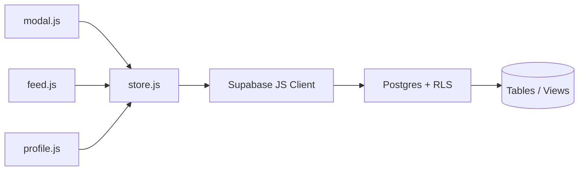

# SineLog — Database System Research

Database architecture for SineLog: **Supabase (PostgreSQL)**, Row Level Security, views, triggers, and how the **JavaScript** layer (`store.js`) consumes them.

---

## Core Schema Architecture

### `public.profiles`

Extends Supabase Auth with public profile fields.

| Column | Notes |
|--------|--------|
| `id` | UUID, matches `auth.users.id` |
| `username`, `display_name`, `bio`, `avatar_url` | Shown in feed and profile UI |

Created by trigger `handle_new_user()` on signup.

### `public.film_logs`

Primary diary table — one row per user per film (`UNIQUE(user_id, tmdb_id)`).

| Column | Type / role |
|--------|-------------|
| `tmdb_id` | TMDB movie id (integer) |
| `movie_title`, `poster_path` | Cached for feed display |
| `rating` | `NUMERIC(2,1)` — half-stars (e.g. 4.5) |
| `review` | Free-text diary entry |
| `liked` | User “heart” for the film |
| `is_rewatch` | Rewatch indicator |
| `has_spoilers` | Blur review in feed when true |
| `watched_on` | Date watched |

**JS access:** `SL.Store.logs.upsert()` in `modal.js` on Log Film.

### `public.watchlist`

Films the user intends to watch. Toggled from the modal via `SL.Store.watchlist.toggle()`.

### `public.follows`

Social graph (`follower_id`, `following_id`). Self-follow blocked by `CHECK` constraint.

### `public.review_likes`

Reactions on feed reviews.

| Column | Notes |
|--------|--------|
| `reaction_type` | `'like'` or `'dislike'` |
| `log_id` | References `film_logs.id` |

**JS access:** `SL.Store.reactions.toggle(logId, type)` from `ui/feed.js`.

### `public.review_comments`

Threaded comments on a log/review.

**JS access:** `SL.Store.comments.*` — list, add, update, delete (owner only via RLS).

---

## Advanced Database Features

### Row Level Security (RLS)

- **SELECT:** Generally open for public social features (profiles, feed view).
- **INSERT / UPDATE / DELETE:** `auth.uid() = user_id` (or equivalent) on owned rows.

The JavaScript client sends the user JWT; Postgres enforces policy — no trust in client-only checks.

### Triggers

- **`handle_new_user()`** — After `auth.users` insert, creates matching `profiles` row from signup metadata.

### Views (Security Invoker)

| View | Purpose |
|------|---------|
| `activity_feed` | Joins logs + profiles; exposes `like_count`, `dislike_count`, `comment_count`, `has_spoilers` |
| `profile_stats` | Aggregates films logged, likes, watchlist size, follower counts |

Feed page JavaScript reads `activity_feed` only — no manual joins in the browser.

---

## Frontend API (`store.js`)

### Log a film

```js
await SL.Store.logs.upsert(tmdbId, movieTitle, posterPath, {
  rating: 4.5,
  review: 'Mind-bending third act.',
  liked: true,
  rewatch: false,
  hasSpoilers: false,
  watchedOn: '2026-05-20',
});
```

### Activity feed

```js
const page = await SL.Store.feed.global(0, 20);
const followingOnly = await SL.Store.feed.following(0, 20);
```

### Social

```js
await SL.Store.follows.toggle(targetUserId);
const following = await SL.Store.follows.isFollowing(targetUserId);
await SL.Store.reactions.toggle(logId, 'like');
const comments = await SL.Store.comments.list(logId);
```

---

## Migrations and Maintenance

Run on a **new** project:

1. `supabase-schema.sql` — base tables, RLS, core views

Then apply as needed:

| File | Adds |
|------|------|
| `supabase-migration-half-star-ratings.sql` | Decimal ratings |
| `supabase-migration-rewatch.sql` | `is_rewatch` column |
| `supabase-migration-spoilers.sql` | `has_spoilers`, updated `activity_feed` |
| `supabase-migration-feed-interactions.sql` | Dislikes + `review_comments` |
| `supabase-one-for-all-cleanup.sql` | Consolidated sync of views/columns |

> If feed cards miss `dislike_count` or `has_spoilers`, re-run the latest migration or the one-for-all cleanup script.

---

## Data Flow: JavaScript to Postgres



---

## Related Documentation

- [javascript_research.md](javascript_research.md) — `SL.Store` method context
- [system_design.md](system_design.md) — architecture overview
- [PRESENTATION.md](PRESENTATION.md) — demo flows showing DB-backed features live
