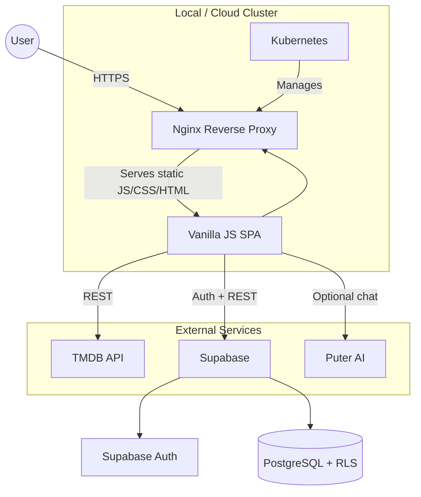
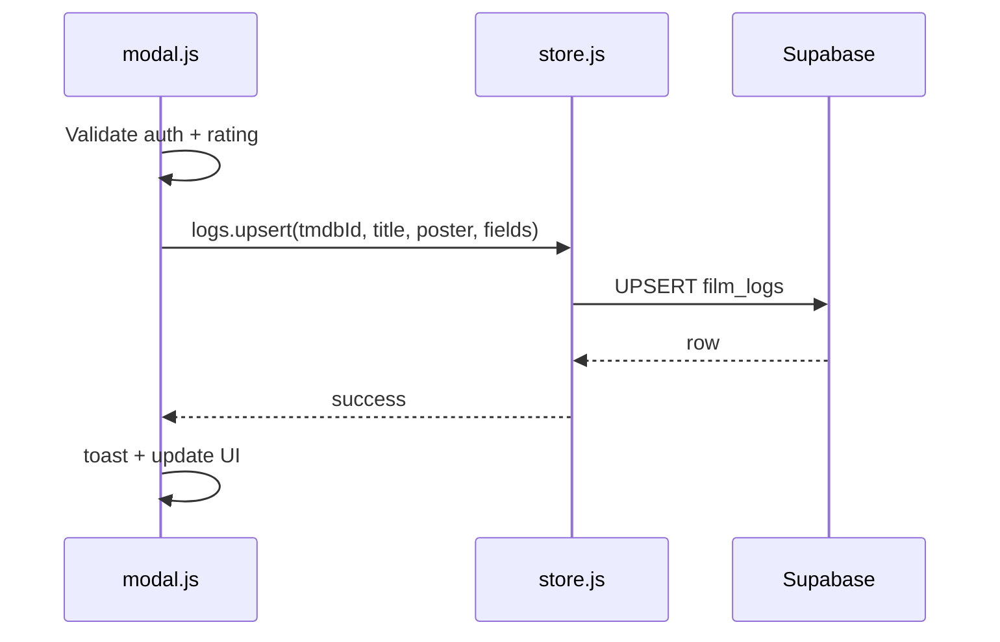
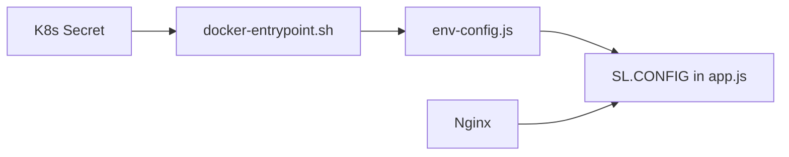

# SineLog — System Design Document

Architecture of **SineLog**: frontend JavaScript SPA, Supabase backend, external APIs, and Kubernetes deployment.

**Presentation flows:** [PRESENTATION.md](PRESENTATION.md) (system flow diagrams + live demo script)

---

## High-Level Architecture

SineLog uses a **client–service** model. The browser runs all UI logic; there is no custom Node/Java API server.



---

## Frontend Design (JavaScript SPA)

### Namespace architecture (`SL`)

All application code hangs off `window.SL`, loaded in a fixed order from `index.html`:

1. `env-config.js` — runtime keys (Docker/K8s)
2. `app.js` — router, config, shared utilities
3. `tmdb.js`, `auth.js`, `store.js`, `nav.js`, `modal.js`
4. `ui/*.js` — page views
5. Bootstrap IIFE — Supabase client, `Auth.init()`, initial route

Each module uses the **revealing module pattern**:

```js
SL.SomeModule = (() => {
  // private helpers
  return { publicMethod };
})();
```

### Routing

`SL.Router` (`app.js`):

- Registers pages: `home`, `feed`, `profile`, `search-page`, etc.
- `navigate(name, params)` renders into `#app` without full reload
- Updates URL with `history.pushState` → `#page?query`
- `popstate` restores views when the user presses Back
- Closes `SL.Modal` on route change

### UI composition

| Component | File | Responsibility |
|-----------|------|----------------|
| Shell | `index.html` | Nav, `#app`, modals, toast, script tags |
| Pages | `ui/*.js` | Fetch data, build HTML, bind events |
| Movie modal | `modal.js` | TMDB detail, log form, community reviews, taste match |
| Navbar | `nav.js` | Routes, debounced TMDB + profile search |
| Styles | `styles.css` | Tokens, glass UI, modal layout, feed/profile |

### Modal layout (hero + body)

The movie modal separates **hero imagery**, a **floating overlay** (trailer, logged badge), and **body content** that overlaps the hero for the poster. This avoids click-blocking while keeping the original visual design.

---

## Backend and Data Layer

### Supabase (Postgres + Auth)

- **No custom backend server** — browser talks to Supabase with the anon key + user JWT.
- **RLS** enforces row ownership on writes; public reads for feeds and profiles.
- **Views** `activity_feed` and `profile_stats` pre-join data for the JavaScript layer.

See [research.md](research.md) for table-level detail.

### Core JavaScript data flows

#### Log a film



#### Load activity feed

1. `ui/feed.js` → `SL.Store.feed.global()`
2. Supabase selects from `activity_feed` view
3. JavaScript maps rows to cards; spoiler CSS classes applied when `has_spoilers`
4. Reactions call `SL.Store.reactions.toggle()` → `review_likes` table

#### Open film from search

1. `nav.js` debounced handler → `SL.TMDB.search()`
2. User selects result → `SL.Modal.open(tmdbId)`
3. `Promise.all([detail, credits, getMyLog, watchlist])` → single render pass

---

## External Integrations

| Service | Used for | JS entry point |
|---------|----------|----------------|
| TMDB | Posters, metadata, videos, search | `SL.TMDB` |
| Supabase | Auth, logs, feed, follows, comments | `SL.Store`, `SL.Auth` |
| Puter | Taste match prompt (optional) | `modal.js`, `ui/profile.js` |

TMDB `detail` requests `append_to_response=videos` so the modal can resolve a YouTube trailer key.

---

## Infrastructure and Deployment

### Docker

- Multi-stage build → `nginx:alpine` serves static files
- `docker-entrypoint.sh` writes `/env-config.js` from environment variables

### Kubernetes

Manifests under `k8s/`: Deployment (3 replicas), Service, Secret, ConfigMap, HPA, PDB, NetworkPolicy, PV/PVC.

Operational demos: [DEPLOYMENT.md](DEPLOYMENT.md).



---

## Security Posture

- **RLS** on all user-owned tables
- **HTML escaping** via `SL.esc()` for user-generated text in templates
- **JWT** attached by Supabase client for authenticated requests
- **Secrets** in K8s / env, not committed (use `secret.yaml` template locally)
- **NetworkPolicy** limits pod egress to required endpoints (cluster config)

---

## Performance Practices

- TMDB image sizes chosen per context (`w92`, `w342`, `w1280`)
- Debounced search (`SL.debounce`) in `nav.js` and browse page
- `Promise.all` for parallel modal loads
- SQL views to avoid N+1 queries from the client
- Skeleton loaders while async data resolves

---

## Related Documentation

- [javascript_research.md](javascript_research.md) — module APIs and JS patterns
- [PRESENTATION.md](PRESENTATION.md) — presenter system + demonstration flows
- [research.md](research.md) — database schema
- [DEPLOYMENT.md](DEPLOYMENT.md) — Kubernetes procedures
