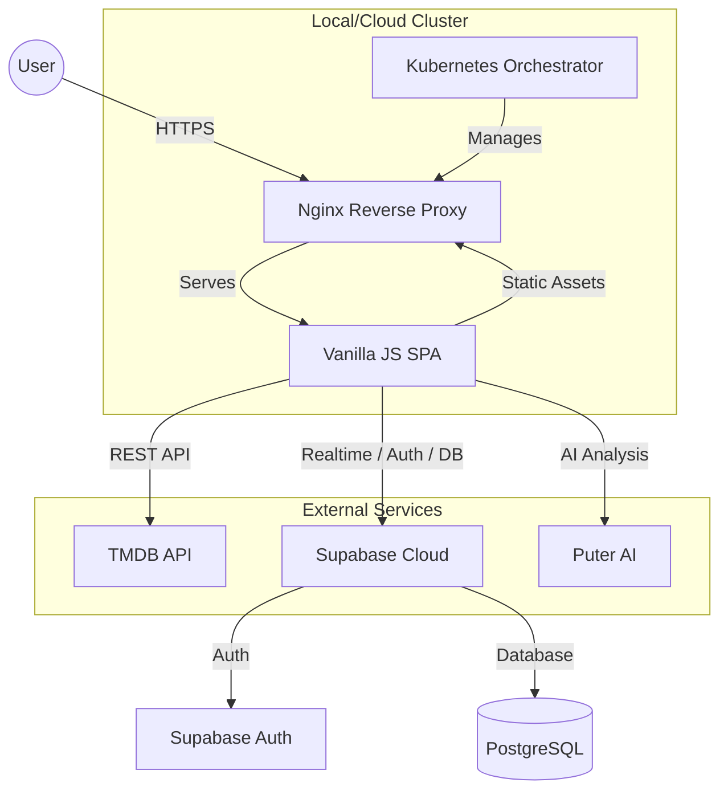

# SineLog — System Design Document

This document outlines the end-to-end architecture of **SineLog**, a production-grade film tracking and social platform. It covers the frontend structure, backend services, data flow, and infrastructure orchestration.

---

## 🏛️ High-Level Architecture

SineLog follows a **Client-Server-Service** model. The frontend is a decoupled Single Page Application (SPA) that communicates with a managed Backend-as-a-Service (Supabase) and external metadata providers (TMDB).

---

## 💻 Frontend Design

The frontend is built with **Vanilla JavaScript** using a modular "Namespace" architecture (`SL`).

- **Architecture**: Single Page Application (SPA).
- **Routing**: Client-side router that dynamically mounts views into an `#app` shell, fully integrated with the browser's History API for deep linking and back-button support.
- **State Management**: Distributed across modules (`SL.Auth` for user state, `SL.Store` for database cache).
- **Styling**: Modern CSS3 with **Glassmorphism** aesthetics, utilizing `backdrop-filter`, CSS Variables, and Dynamic Viewport Units (`dvh`) for a consistent, responsive design system.

---

## 🗄️ Backend & Data Layer

SineLog leverages **Supabase** (Postgres) for its backend infrastructure.

### 1. Security (Row Level Security)
Instead of a middle-tier API server, SineLog uses **RLS** directly in Postgres. 
- **Public Data**: Feeds and profiles are readable by anyone.
- **Private Data**: Logging, following, and watchlists require a valid JWT (JSON Web Token) from Supabase Auth, verified at the database level.

### 2. Relational Schema
The database is structured to support social features:
- **One-to-Many**: One user to many film logs.
- **Many-to-Many**: Following system, thumbs up/down review reactions, and nested review comments.
- **Computed Views**: `profile_stats` and `activity_feed` are used for performant data retrieval with pre-joined metadata.

---

## 🔄 Core Data Flows

### Scenario: Logging a Film
1. **User Action**: User clicks "Log" in the Movie Modal.
2. **Logic Layer**: `modal.js` calls `SL.Store.logs.upsert()`.
3. **Auth Check**: `SL.Store` verifies the user session via `SL.Auth`.
4. **Database Entry**: An `UPSERT` command is sent to Supabase (including metadata like ratings, reviews, and spoiler flags).
5. **Trigger**: If it's a new user, a Postgres Trigger handles profile creation.
6. **UI Update**: `SL.toast` notifies success, and the view is re-rendered to show the new "Logged" status.

---

## 🚢 Infrastructure & Deployment

The application is containerized and orchestrated for high availability.

### 1. Containerization (Docker)
- **Multi-stage Build**: A small `alpine` image builds the project, then serves it via `nginx:alpine`.
- **Environment Injection**: `docker-entrypoint.sh` dynamically generates an `env-config.js` file at runtime, allowing the same image to be used across Development, Staging, and Production.

### 2. Orchestration (Kubernetes)
The K8s cluster (managed via Docker Desktop) ensures the system is resilient:
- **Self-Healing**: Liveness/Readiness probes restart unhealthy containers.
- **Scaling**: **Horizontal Pod Autoscaler (HPA)** scales the Nginx pods based on CPU/Memory usage.
- **Storage**: **PersistentVolumes (PV)** are used to retain Nginx logs across pod restarts.
- **Reliability**: **PodDisruptionBudgets (PDB)** guarantee a minimum number of replicas are always online during maintenance.

---

## 🔒 Security Posture

- **API Security**: TMDB and Supabase keys are never hardcoded; they are managed as **Kubernetes Secrets** and injected as environment variables.
- **Network Security**: **Kubernetes NetworkPolicies** restrict traffic, only allowing ingress on port 80 and egress to trusted APIs (Supabase/TMDB).
- **Data Integrity**: Database-level constraints (Unique indexes, Check constraints) prevent malformed data (e.g., following yourself).

---

## 🚀 Performance Optimizations

- **Image Optimization**: TMDB image sizes are requested dynamically based on the UI context (`w92`, `w342`, `w1280`).
- **Debouncing**: All search inputs are debounced to reduce unnecessary API load.
- **Code Separation**: Logic is split into modular files (`auth.js`, `tmdb.js`, etc.) to keep the codebase maintainable and organized.
