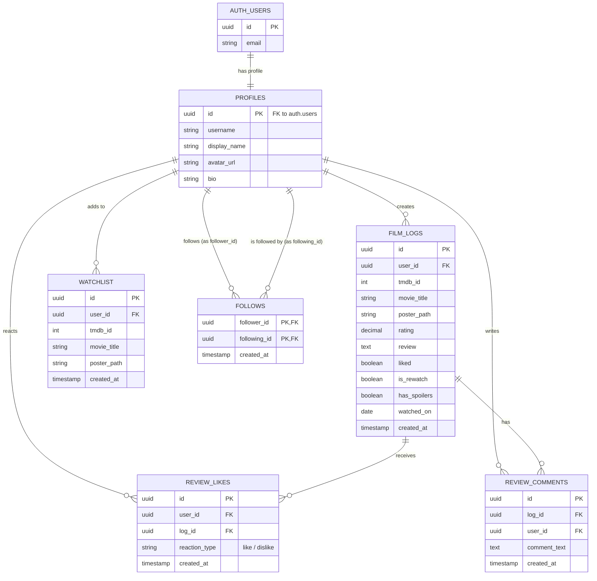
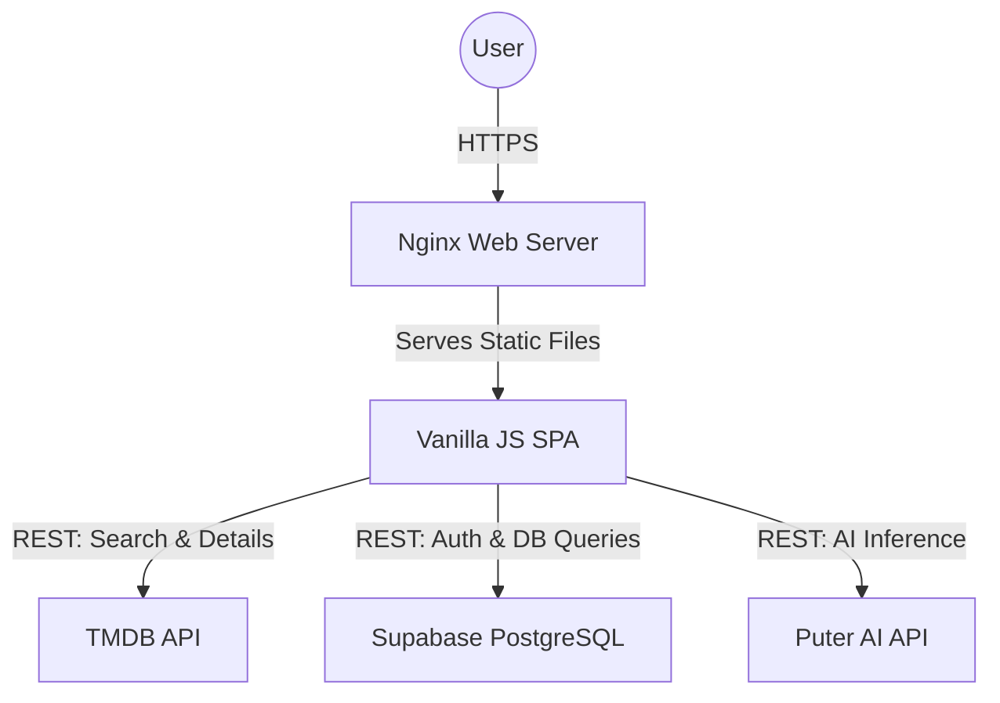
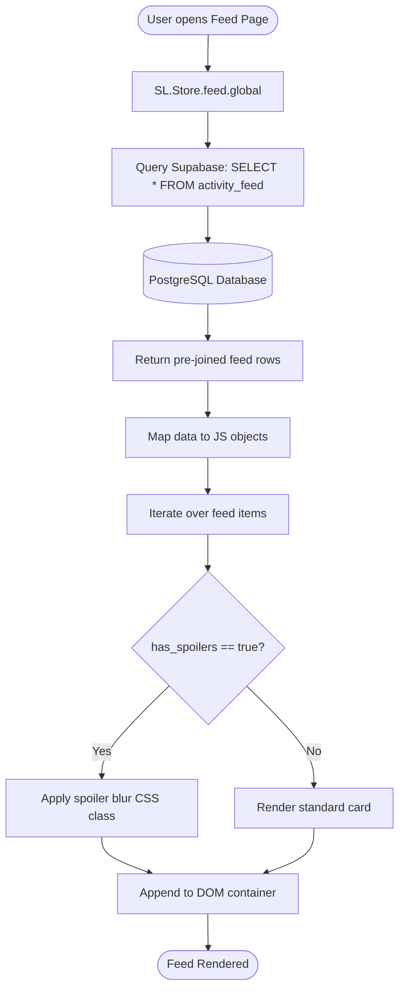
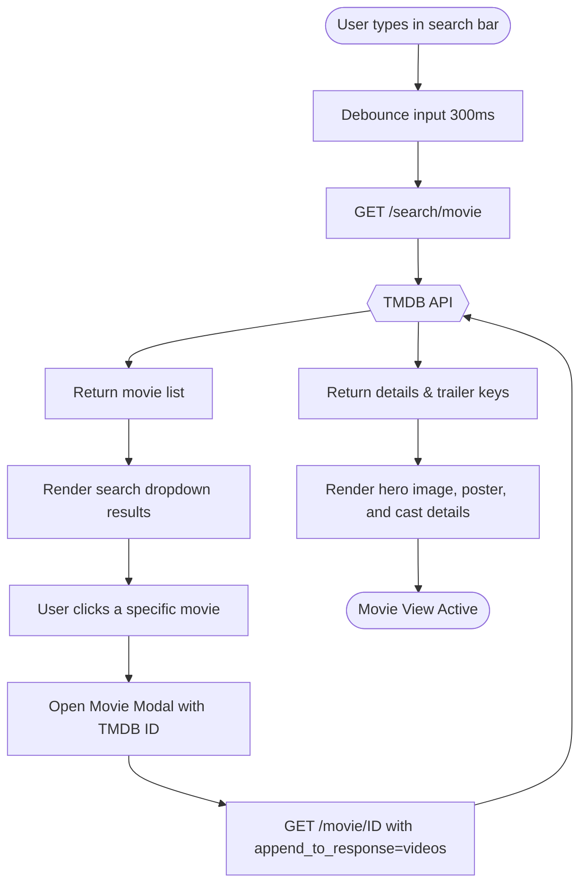
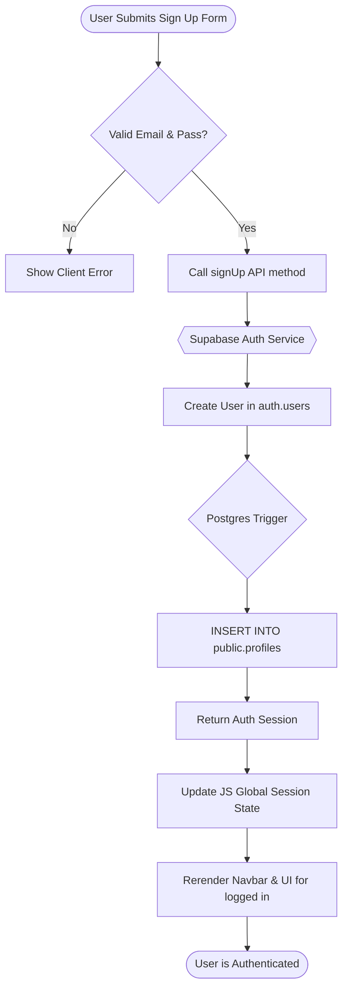
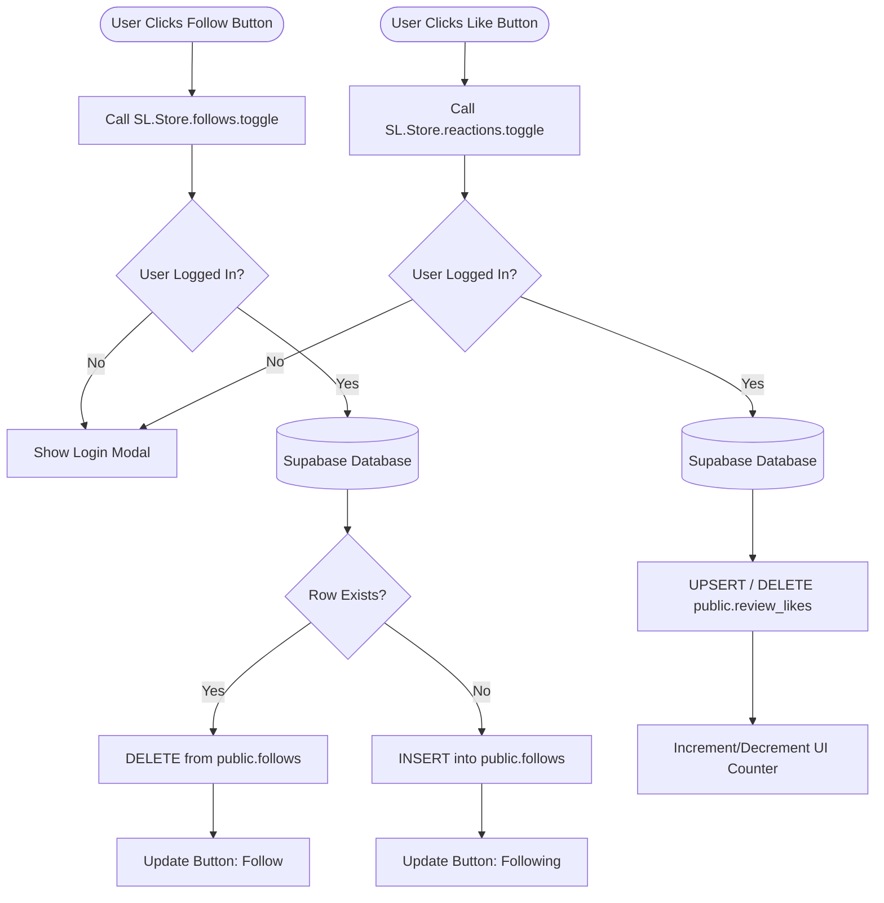
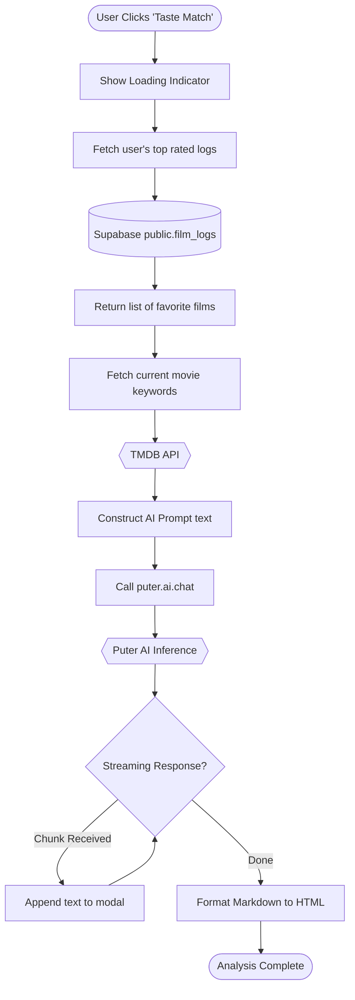

# SineLog — System Overview

## 1. System Planning
SineLog is designed as a modern, client-side Single Page Application (SPA) that interfaces directly with a Backend-as-a-Service (BaaS) and external APIs. The architecture eliminates the need for a custom Node.js or Java backend server, reducing infrastructure complexity and allowing the browser to act as the primary orchestrator.

The system relies on a **client-service model**:
- **Frontend**: A Vanilla JavaScript SPA served by Nginx.
- **Backend & Data**: Supabase provides a PostgreSQL database, authentication, and Row Level Security (RLS) to ensure data integrity without an intermediary API layer.
- **Deployment**: The application is containerized using Docker and orchestrated via Kubernetes for scalable local and cloud deployments.

## 2. Key Features and Functionalities
- **Movie Discovery**: Search for movies, view detailed metadata, cast information, and trailers powered by the TMDB API.
- **Film Logging & Diary**: Log films with half-star ratings, review text, "liked" status, rewatch indicators, spoiler tags, and watch dates.
- **Activity Feed**: View a global and following-only social feed displaying recent film logs from users across the platform.
- **Social Interactions**: Follow other users, like/dislike reviews, and leave threaded comments on logs.
- **Watchlist**: Save movies to a personal watchlist for future viewing.
- **User Profiles**: View personal stats (films logged, watchlist size, followers) and historical diary activity.
- **AI Taste Match**: An experimental feature using Puter AI to compare a user's movie taste (based on their recent logs) against the current movie they are viewing.

## 3. Tools and Technologies Used
- **Frontend**: HTML5, Vanilla JavaScript (ES6+), Vanilla CSS (Glassmorphism design, custom CSS variables, no heavy frameworks).
- **Backend/Database**: Supabase (PostgreSQL database, Supabase Auth).
- **External APIs**: 
  - TMDB API (Movie metadata, search, cast, trailers, posters).
  - Puter.js AI API (Taste match analysis and chat completion).
- **Infrastructure & Deployment**: 
  - Docker (Multi-stage builds using `nginx:alpine`).
  - Kubernetes (Deployments, Services, ConfigMaps, Secrets, Horizontal Pod Autoscalers).
  - Nginx (Web server and reverse proxy for serving static assets).

## 4. Database
SineLog utilizes PostgreSQL (via Supabase) with strong Row Level Security (RLS). This ensures users can only modify their own data while allowing public reads for social features, effectively trusting the database to handle authorization.

### Core Schema
- `profiles`: Extended user data (username, avatar, bio). Automatically synced via a trigger when a new user signs up.
- `film_logs`: The core diary table storing TMDB ID, ratings, reviews, dates, and spoiler flags. Enforces unique entries per user per film.
- `watchlist`: Stores films that users intend to watch.
- `follows`: Manages the social graph (follower/following relationships).
- `review_likes`: Tracks user reactions (likes/dislikes) on film logs.
- `review_comments`: Threaded comments on user reviews.

### Entity-Relationship Diagram (ERD)


### Views (Security Invoker)
- `activity_feed`: Pre-joins logs, profiles, and interaction counts to optimize client-side data fetching and prevent N+1 queries.
- `profile_stats`: Aggregates user metrics (e.g., total films logged, follower counts).

## 5. Detailed System Flow

### Overall System Architecture Flow


### Film Logging Flow
When a user decides to log a film from the movie modal:
```mermaid
flowchart TD
    Start([User clicks "Log Film"]) --> Fill[Fill form: Rating, Review, Dates]
    Fill --> Val{Is input valid?}
    Val -- No --> Error[Show validation error]
    Val -- Yes --> CallStore[SL.Store.logs.upsert]
    CallStore --> API[Send REST request with JWT]
    API --> DB[(Supabase PostgreSQL)]
    DB --> RLS{RLS Check pass?}
    RLS -- No --> AuthErr[Reject insert]
    RLS -- Yes --> Write[UPSERT into public.film_logs]
    Write --> Ret[Return inserted row]
    Ret --> Toast[Display success toast]
    Toast --> UpdateUI[Update modal UI state]
    UpdateUI --> End([End Flow])
```

### Activity Feed Loading Flow
When a user navigates to the Home/Feed page:


### Movie Search and View Flow
When a user searches for a movie using the navigation bar:


### Authentication Flow (Sign Up / Sign In)


### Social Interaction Flow (Follow & React)


### AI Taste Match Flow

